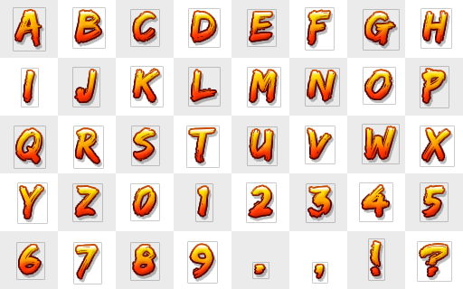

# Game Component: Image Font

Render text using image fonts in your game.

## Installation

```bash
npm install @basementuniverse/image-font
```

## How to use



We can initialise an image font with a texture atlas and some configuration data:

```ts
import { textureAtlas } from '@basementuniverse/texture-atlas';
import { ImageFont } from '@basementuniverse/image-font';

let font: ImageFont | null = null;

const image = new Image();
image.src = './image-font.png';
image.onload = () => {
  const atlas = textureAtlas(
    image,
    {
      relative: true,
      width: 8,
      height: 5,
      regions: {
        'A': { x: 0, y: 0 },
        'B': { x: 1, y: 0 },
        'C': { x: 2, y: 0 },
        // ...etc.
      },
    }
  );

  font = new ImageFont(
    atlas,
    {
      defaultCharacterConfig: {
        offset: { x: 14, y: 8 },
        width: 32,
        height: 48,
      },
      characters: {
        'A': { width: 37 },
        'B': { width: 37 },
        'C': { width: 33 },
        // ...etc.
      }
    }
  );
};
```

Or we can use a content processor:

```ts
import { imageFontContentProcessor } from '@basementuniverse/image-font';
import ContentManager from '@basementuniverse/content-manager';

ContentManager.initialise({
  processors: {
    imageFont: imageFontContentProcessor,
  },
});

ContentManager.load([
  {
    name: 'font-spritesheet',
    type: 'image',
    args: ['./image-font.png'],
  },
  {
    name: 'font',
    type: 'json',
    args: [
      // Path to .json or inline JSON:
      {
        textureAtlasSize: { x: 8, y: 5 },
        defaultCharacterConfig: {
          offset: { x: 14, y: 8 },
          width: 32,
          height: 48,
        },
        characters: {
          'A': { textureAtlasPosition: { x: 0, y: 0 }, width: 37 },
          'B': { textureAtlasPosition: { x: 1, y: 0 }, width: 37 },
          'C': { textureAtlasPosition: { x: 2, y: 0 }, width: 33 },
          // ...etc.
        }
      }
    ],
    processors: [
      {
        name: 'imageFont',
        args: ['font-spritesheet'],
      },
    ],
  },
]);

// ContentManager.get('font') returns an ImageFont instance
```

Then we can use the `ImageFont` instance to measure and render text:

```ts
// Measure text
const textSize = font.measureText('ABC', options);

// Render text
font.drawText(context, 'ABC', 0, 0, options);
```

See './example/example.html' for a full example.

## Glyph layout

For effects that require per-character control — typewriter reveals, path-following, per-character animations — you can separate the *layout* phase from the *draw* phase using `layoutText` and `drawLayout`.

`layoutText` runs the same line-splitting, alignment, and cursor-advance logic as `drawText`, but instead of drawing immediately it returns a `GlyphLayout` object containing a `glyphs` array. Each element of the array is a `GlyphInfo` object describing one character in the rendered output. You can inspect and mutate these objects freely before passing the layout to `drawLayout`.

`drawText` is unchanged and continues to work as before.

### Typewriter reveal

```ts
const layout = font.layoutText('HELLO WORLD', x, y, options);

// In your update loop, track how many characters have been revealed:
layout.glyphs.forEach((glyph, i) => {
  glyph.visible = i < revealedCount;
});

// In your draw loop:
font.drawLayout(context, layout);
```

### Per-character animation (wave)

```ts
const layout = font.layoutText('HELLO WORLD', x, y, options);

// Each frame, apply a sine-wave vertical offset to every glyph:
layout.glyphs.forEach((glyph, i) => {
  glyph.offset = { x: 0, y: Math.sin(Date.now() / 200 + i * 0.5) * 4 };
});

font.drawLayout(context, layout);
```

### Per-character colour gradient

```ts
const layout = font.layoutText('RAINBOW', x, y, options);
const hueStep = 360 / layout.glyphs.length;

layout.glyphs.forEach((glyph, i) => {
  glyph.color = `hsl(${i * hueStep}, 100%, 50%)`;
});

font.drawLayout(context, layout);
```

### Text along a path

```ts
const layout = font.layoutText('ALONG A CURVE', 0, 0, options);

// Place each glyph at a point on a path, rotating it to follow the tangent:
let distance = 0;
layout.glyphs.forEach(glyph => {
  const { point, tangentAngle } = samplePath(path, distance + glyph.advance / 2);
  glyph.position = { x: point.x - glyph.size.x / 2, y: point.y - glyph.size.y / 2 };
  glyph.rotation = tangentAngle;
  distance += glyph.advance;
});

font.drawLayout(context, layout);
```

### `preDraw` / `postDraw` callbacks

For effects that require additional canvas operations around individual characters (outlines, drop shadows, debug bounds), use the `preDraw` and `postDraw` callbacks on each `GlyphInfo`. The context is saved before and restored after each glyph when any per-glyph property is set.

```ts
const layout = font.layoutText('OUTLINED', x, y, options);

layout.glyphs.forEach(glyph => {
  glyph.postDraw = (ctx, g) => {
    ctx.strokeStyle = 'black';
    ctx.lineWidth = 2;
    ctx.strokeRect(g.bounds.x, g.bounds.y, g.bounds.width, g.bounds.height);
  };
});

font.drawLayout(context, layout);
```

## GlyphLayout and GlyphInfo types

```ts
type GlyphLayout = {
  /** The original text string that was laid out */
  text: string;

  /** The x position originally passed to layoutText */
  x: number;

  /** The y position originally passed to layoutText */
  y: number;

  /** The rendering options used to produce this layout */
  options?: ImageFontRenderingOptions;

  /**
   * The total bounding box of the laid-out text in canvas pixels
   *
   * Equivalent to the value returned by measureText with the same arguments
   */
  bounds: vec2;

  /**
   * Per-glyph layout information, one entry per character in the rendered
   * output (after wrapping/truncation)
   *
   * Glyphs with no atlas texture (e.g. spaces) are included with
   * visible: false so that index-based effects remain aligned with the string
   */
  glyphs: GlyphInfo[];
};

type GlyphInfo = {
  /** The character this glyph represents */
  character: string;

  /**
   * The sequential index of this glyph in the layout (0-based)
   *
   * This is the glyph's position in the rendered output (after any wrapping
   * or truncation applied by the overflow options), not necessarily its index
   * in the original input string
   */
  index: number;

  /** The line index this glyph is on (0-based) */
  lineIndex: number;

  /**
   * The top-left draw position of this glyph in canvas pixels
   *
   * Computed from the cursor position minus any configured per-character or
   * global offset, with the font and render scale already applied
   */
  position: vec2;

  /**
   * The size of this glyph's atlas tile in canvas pixels (post-scale)
   *
   * Will be (0, 0) for glyphs that have no texture in the atlas (e.g. spaces)
   */
  size: vec2;

  /**
   * The advance width of this glyph in canvas pixels
   *
   * This is how far the cursor moves after this glyph, including kerning
   */
  advance: number;

  /**
   * The bounding box of this glyph in canvas pixels
   *
   * Equivalent to { x: position.x, y: position.y, width: size.x, height: size.y }.
   * Useful for hit-testing, debug overlays, and path-following calculations
   */
  bounds: { x: number; y: number; width: number; height: number };

  /**
   * Whether this glyph should be rendered
   *
   * Automatically false for characters with no texture in the atlas (e.g.
   * spaces). Set to false manually to hide individual glyphs (typewriter
   * reveal etc.)
   */
  visible: boolean;

  /**
   * Additional per-glyph draw offset in canvas pixels, applied on top of the
   * computed position
   */
  offset?: vec2;

  /**
   * Per-glyph scale multiplier, applied around the pivot point
   *
   * Multiplied on top of the font and render scale already baked into
   * position and size
   */
  scale?: number;

  /**
   * Rotation in radians, applied around the pivot point
   */
  rotation?: number;

  /**
   * The pivot point for rotation and scale transforms, in canvas pixels
   *
   * Defaults to the centre of the glyph's bounding box (after any per-glyph
   * offset is applied)
   */
  pivot?: vec2;

  /**
   * Opacity multiplier (0–1), multiplied against the context's current
   * globalAlpha at the time drawLayout is called
   */
  alpha?: number;

  /**
   * Per-glyph color override
   *
   * Overrides the color set in the layout's ImageFontRenderingOptions for this
   * glyph only. The coloringMode and coloringFunction from the layout options
   * are still used
   */
  color?: string;

  /**
   * Called immediately before this glyph is drawn, after all canvas transforms
   * have been applied
   *
   * The context is saved and restored around each glyph when any per-glyph
   * property (alpha, rotation, scale, preDraw, postDraw) is set
   */
  preDraw?: (context: CanvasRenderingContext2D, glyph: GlyphInfo) => void;

  /**
   * Called immediately after this glyph is drawn, before the context is
   * restored
   *
   * Useful for outlines, drop shadows, or debug bounding boxes
   */
  postDraw?: (context: CanvasRenderingContext2D, glyph: GlyphInfo) => void;
};
```

## ImageFont configuration

```ts
type ImageFontConfig = {
  /**
   * Global offset applied to all characters from top-left of the texture atlas
   * tile, measured in pixels
   */
  offset?: vec2;

  /**
   * Optional scaling factor for the font
   */
  scale?: number;

  /**
   * Default character configuration, used for characters that do not have
   * a specific configuration defined, or for undefined characters
   */
  defaultCharacterConfig?: ImageFontCharacterConfig;

  /**
   * Per-character configuration
   */
  characters: Record<string, ImageFontCharacterConfig>;
};

type ImageFontCharacterConfig = {
  /**
   * Offset from the top-left of the texture atlas tile, measured in pixels
   */
  offset?: vec2;

  /**
   * Width of the character in pixels, used for kerning
   *
   * If not specified, use the default width, or the width of the texture atlas
   * tile
   */
  width?: number;

  /**
   * Height of the character in pixels, used for measuring text
   *
   * If not specified, use the default height, or the height of the texture
   * atlas tile
   */
  height?: number;
};
```

## Image Font content data

When using a content processor, the configuration data for an image font is the same as the `ImageFontConfig` type, but with an additional `textureAtlasSize: vec2` property, containing the size of the texture atlas in tiles.

Also, each character configuration should have a `textureAtlasPosition: vec2` property, containing the tile address of the character in the texture atlas.

## Rendering and measuring options

```ts
type OverflowMode = 'word-wrap' | 'character-wrap' | 'hidden' | 'ellipsis' | 'none';

type ImageFontRenderingOptions = {
  /**
   * The scale factor to apply to the font when rendering
   */
  scale?: number;

  /**
   * Whether to disable per-character width and draw every character with the
   * same spacing
   *
   * If this is true, the kerning value will be used and measured in pixels
   *
   * If this is true and the kerning value is undefined, use the pixel width
   * of each texture atlas tile
   */
  monospace?: boolean;

  /**
   * The amount of kerning to apply between characters
   *
   * 0 means no spacing between characters, 1 means normal spacing, 2 means
   * double spacing, etc.
   *
   * Default is 1
   */
  kerning?: number;

  /**
   * Horizontal alignment of the text relative to the x position
   *
   * Default is 'left'
   */
  align?: 'left' | 'center' | 'right';

  /**
   * Verticle alignment of the text relative to the baseline
   *
   * Default is 'top'
   */
  baseLine?: 'top' | 'middle' | 'bottom';

  /**
   * Color to apply to the text
   *
   * If not specified, no coloring is applied
   */
  color?: string;

  /**
   * How to apply the color
   *
   * Default is 'multiply'
   */
  coloringMode?: ColoringMode;

  /**
   * Custom coloring function when coloringMode is 'custom'
   *
   * If coloringMode is 'custom' but no function is provided, falls back to
   * 'multiply'
   */
  coloringFunction?: (
    context: CanvasRenderingContext2D,
    texture: HTMLCanvasElement,
    color: string
  ) => void;

  /**
   * Maximum width of the text in pixels (pre-scale)
   *
   * When set, text that exceeds this width will be handled according to the
   * overflow option. Alignment works correctly regardless of maxWidth.
   *
   * If not specified, text will not be wrapped or clipped.
   */
  maxWidth?: number;

  /**
   * How to handle text that exceeds maxWidth
   *
   * - 'word-wrap': wrap at word boundaries (falls back to character-wrap for
   *   single words that exceed maxWidth)
   * - 'character-wrap': wrap at character boundaries
   * - 'hidden': text is cut off at maxWidth
   * - 'ellipsis': text is cut off and an ellipsis string is appended
   * - 'none': maxWidth is ignored
   *
   * Default is 'word-wrap'
   */
  overflow?: OverflowMode;

  /**
   * The string to use as an ellipsis when overflow is 'ellipsis'
   *
   * Default is '...'
   */
  ellipsisString?: string;

  /**
   * The height of each line in pixels (pre-scale), scaled by the active scale
   * factor
   *
   * If not specified, defaults to the tallest character defined in the font,
   * giving consistent line spacing regardless of the actual string content.
   */
  lineHeight?: number;
};
```

### Multi-line text example

```ts
// Word-wrap within 200px, with custom line height
font.drawText(context, 'HELLO WORLD THIS IS A LONG STRING', x, y, {
  maxWidth: 200,
  overflow: 'word-wrap',
  lineHeight: 50,
  align: 'center',
  baseLine: 'top',
});

// Truncate with ellipsis
font.drawText(context, 'HELLO WORLD', x, y, {
  maxWidth: 100,
  overflow: 'ellipsis',
  ellipsisString: '...',
});

// measureText respects wrapping and returns the actual rendered bounding box
const size = font.measureText('HELLO WORLD', { maxWidth: 100, overflow: 'word-wrap' });
```

## Utility scripts

It can be rather tedious creating data for large image-fonts with lots of characters, so I vibe-coded a utility script to help with that in './example/generate-data.html'.

You will need to run this using [http-server](https://www.npmjs.com/package/http-server) or a similar tool to serve the HTML file, because it loads images and renders/processes them using a canvas; your browser will complain about this if you open the HTML file directly.

We also have a script './example/rescale.js' which re-scales sizes and offsets in a configuration JSON file by a given factor, which is useful if you want to change the size of an existing font texture atlas without having to manually edit all the values.
