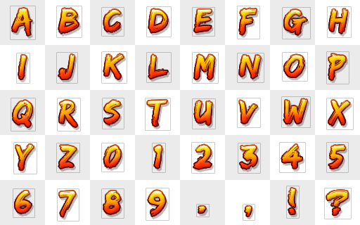

# Game Component: Image Font

Render text using image fonts in your game.

## Installation

```bash
npm install @basementuniverse/image-font
```

## How to use



We can initialise an image font with a texture atlas and some configuration data:

```ts
import { textureAtlas } from '@basementuniverse/texture-atlas';
import { ImageFont } from '@basementuniverse/image-font';

let font: ImageFont | null = null;

const image = new Image();
image.src = './image-font.png';
image.onload = () => {
  const atlas = textureAtlas(
    image,
    {
      relative: true,
      width: 8,
      height: 5,
      regions: {
        'A': { x: 0, y: 0 },
        'B': { x: 1, y: 0 },
        'C': { x: 2, y: 0 },
        // ...etc.
      },
    }
  );

  font = new ImageFont(
    atlas,
    {
      defaultCharacterConfig: {
        offset: { x: 14, y: 8 },
        width: 32,
        height: 48,
      },
      characters: {
        'A': { width: 37 },
        'B': { width: 37 },
        'C': { width: 33 },
        // ...etc.
      }
    }
  );
};
```

Or we can use a content processor:

```ts
import { imageFontContentProcessor } from '@basementuniverse/image-font';
import ContentManager from '@basementuniverse/content-manager';

ContentManager.initialise({
  processors: {
    imageFont: imageFontContentProcessor,
  },
});

ContentManager.load([
  {
    name: 'font-spritesheet',
    type: 'image',
    args: ['./image-font.png'],
  },
  {
    name: 'font',
    type: 'json',
    args: [
      // Path to .json or inline JSON:
      {
        textureAtlasSize: { x: 8, y: 5 },
        defaultCharacterConfig: {
          offset: { x: 14, y: 8 },
          width: 32,
          height: 48,
        },
        characters: {
          'A': { textureAtlasPosition: { x: 0, y: 0 }, width: 37 },
          'B': { textureAtlasPosition: { x: 1, y: 0 }, width: 37 },
          'C': { textureAtlasPosition: { x: 2, y: 0 }, width: 33 },
          // ...etc.
        }
      }
    ],
    processors: [
      {
        name: 'imageFont',
        args: ['font-spritesheet'],
      },
    ],
  },
]);

// ContentManager.get('font') returns an ImageFont instance
```

Then we can use the `ImageFont` instance to measure and render text:

```ts
// Measure text
const textSize = font.measureText('ABC', options);

// Render text
font.drawText(context, 'ABC', 0, 0, options);
```

See './example/example.html' for a full example.

## ImageFont configuration

```ts
type ImageFontConfig = {
  /**
   * Global offset applied to all characters from top-left of the texture atlas
   * tile, measured in pixels
   */
  offset?: vec2;

  /**
   * Optional scaling factor for the font
   */
  scale?: number;

  /**
   * Default character configuration, used for characters that do not have
   * a specific configuration defined, or for undefined characters
   */
  defaultCharacterConfig?: ImageFontCharacterConfig;

  /**
   * Per-character configuration
   */
  characters: Record<string, ImageFontCharacterConfig>;
};

type ImageFontCharacterConfig = {
  /**
   * Offset from the top-left of the texture atlas tile, measured in pixels
   */
  offset?: vec2;

  /**
   * Width of the character in pixels, used for kerning
   *
   * If not specified, use the default width, or the width of the texture atlas
   * tile
   */
  width?: number;

  /**
   * Height of the character in pixels, used for measuring text
   *
   * If not specified, use the default height, or the height of the texture
   * atlas tile
   */
  height?: number;
};
```

## Image Font content data

When using a content processor, the configuration data for an image font is the same as the `ImageFontConfig` type, but with an additional `textureAtlasSize: vec2` property, containing the size of the texture atlas in tiles.

Also, each character configuration should have a `textureAtlasPosition: vec2` property, containing the tile address of the character in the texture atlas.

## Rendering and measuring options

```ts
type ImageFontRenderingOptions = {
  /**
   * The scale factor to apply to the font when rendering
   */
  scale?: number;

  /**
   * Whether to disable per-character width and draw every character with the
   * same spacing
   *
   * If this is true, the kerning value will be used and measured in pixels
   *
   * If this is true and the kerning value is undefined, use the pixel width
   * of each texture atlas tile
   */
  monospace?: boolean;

  /**
   * The amount of kerning to apply between characters
   *
   * 0 means no spacing between characters, 1 means normal spacing, 2 means
   * double spacing, etc.
   *
   * Default is 1
   */
  kerning?: number;

  /**
   * Horizontal alignment of the text relative to the x position
   *
   * Default is 'left'
   */
  align?: 'left' | 'center' | 'right';

  /**
   * Verticle alignment of the text relative to the baseline
   *
   * Default is 'top'
   */
  baseLine?: 'top' | 'middle' | 'bottom';
};
```

## Utility script

It can be rather tedious creating data for large image-fonts with lots of characters, so I vibe-coded a quick-n-hacky utility script to help with that in './example/generate-data.html'.

You will need to run this using [http-server](https://www.npmjs.com/package/http-server) or a similar tool to serve the HTML file, because it loads images and renders/processes them using a canvas; your browser will complain about this if you open the HTML file directly.
